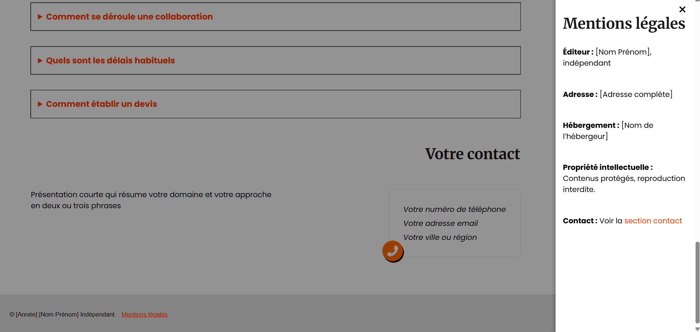

[](https://opensource.org/licenses/MIT)
[](CONTRIBUTING.md)
[](https://accessibilite.numerique.gouv.fr/)

# Template adaptable pour indépendants

Ce template personnalisable est destiné aux indépendants, artisans, autoentrepreneurs ou créateurs souhaitant présenter leur activité.

## Sommaire

- [Présentation](#présentation)
- [Fonctionnalités](#fonctionnalités)
- [Fichiers inclus](#fichiers-inclus)
- [Personnalisation](#personnalisation)
- [Aperçu visuel](#aperçu-visuel)
- [Utilisation](#utilisation)
- [Licence](#licence)

## Présentation

Permet de présenter ses services, projets, FAQ, informations légales et coordonnées sur un site one page à travers des section prêtes à remplir.
Audit lighthouse: performance 97, accessibility 93, practices 96, SEO 100

## Fonctionnalités

- Personnalisation du contenu textuel
- Personnalisation des couleurs et polices avec :root
- Design responsive adapté aux différents formats d'écran
- Accessibilité: navigation clavier, contrastes, réduction des animations

### A réaliser
- Theme light/dark
- Forced-colors
- Prefers-contrast
- Amélioration des petits textes pour certaines déficiences visuelles

## Fichiers inclus

- `index.html` : page d’accueil
- `style.css` : styles de la page
- `script.js` : script de la page
- `README.md` : documentation
- `LICENSE` : licence d’utilisation

## Personnalisation

Remplacer les champs entre crochets :
- Nom Prénom
- Votre métier ou activité...
- Slogan
- Contact

Ajouter vos services, projets et visuels dans les sections correspondantes.

## Aperçu visuel

### Vue desktop




### Vue mobile


### Vue tablette


### Exemple de personnalisation


## Utilisation

Télécharger ou cloner le dépôt :

   ```bash
   git clone https://github.com/compte/projet.git
   ```
Et personnaliser selon vos besoins.

Si vous souhaitez proposer des améliorations, faites le via des issues ou des pull requests.

## Licence

Ce projet est sous licence MIT. Il peut être utilisé, personnalisé et distribué librement, à condition de conserver les mentions d’auteur.
